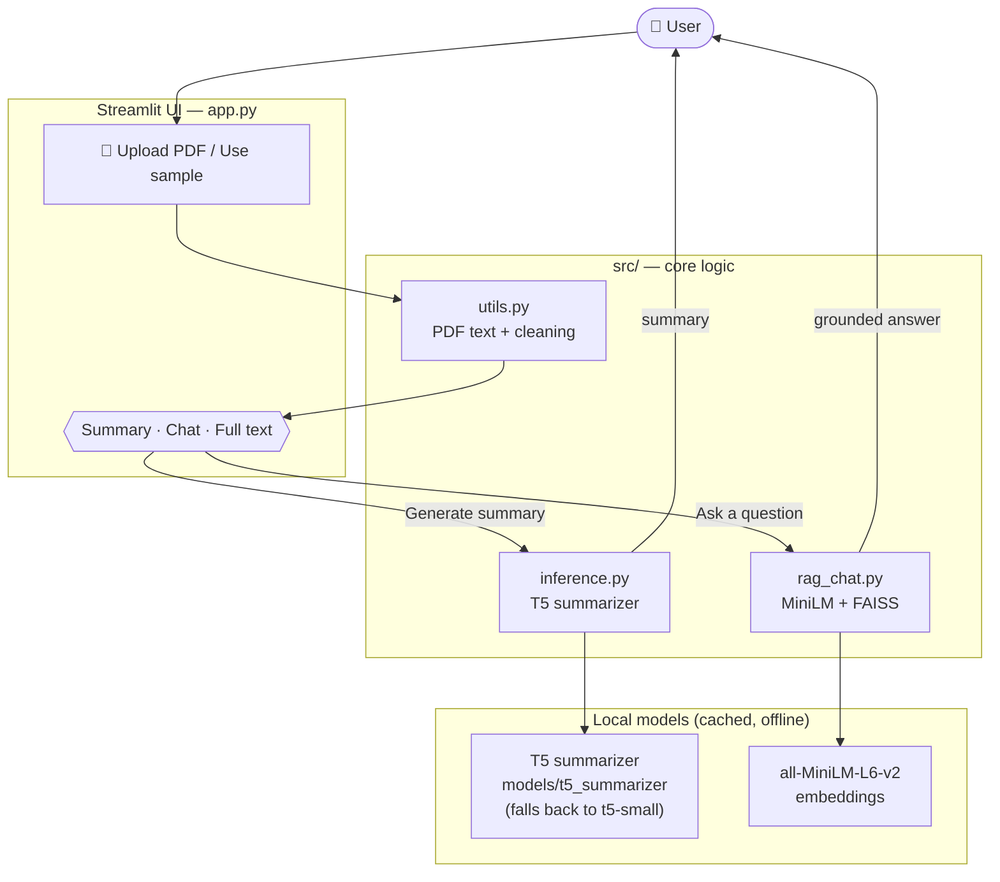
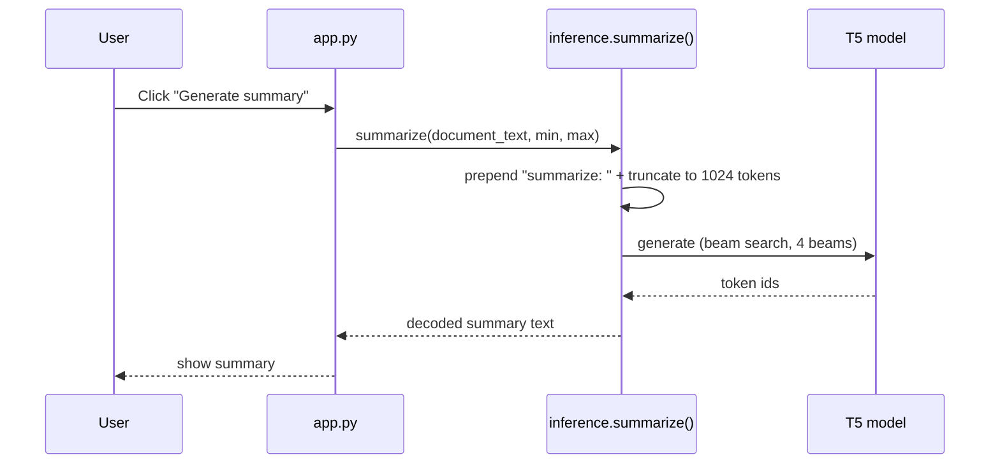
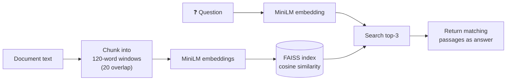
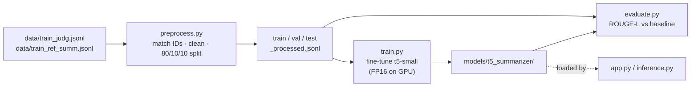

# 🏛️ SpecterSummarizer — Architecture

A simple, honest map of how the app actually works. Everything runs **locally**
with **open-source models** — no external APIs.

---

## 1. The big picture



**One sentence:** the UI extracts text from a PDF, then routes it either to the
**T5 summarizer** (for a summary) or to the **MiniLM + FAISS retriever** (for
chat answers) — both running locally.

---

## 2. Summary flow

What happens when you click **Generate summary**:



- **Model resolution:** uses `models/t5_summarizer/` if it exists, otherwise
  falls back to the pretrained **`t5-small`** so the app always runs.
- **Decoding:** beam search (`num_beams=4`), length penalty `2.0`,
  `no_repeat_ngram_size=3` for fluent, non-repetitive output.
- Loaded once and cached for the session (`@lru_cache`).

---

## 3. Chat flow (extractive RAG)

What happens when you ask a question. The answer is the most relevant
passage(s) of the document, so it stays grounded — no hallucination, no LLM.



**Index is built once per document** (when the Chat tab first opens), then every
question is a fast similarity search against it.

---

## 4. Training & evaluation (offline, run separately)

This pipeline produces the fine-tuned model the app loads. It is **not** part of
the running app — you run it from the command line.



```
python -m src.preprocess              # build splits
python -m src.train --epochs 3 ...    # fine-tune  -> models/t5_summarizer/
python -m src.evaluate --compare-baseline   # ROUGE-L lift over baseline
```

---

## 5. Where each piece lives

| Component            | File                | Responsibility                                  |
| -------------------- | ------------------- | ----------------------------------------------- |
| **UI / entry point** | `app.py`            | Upload, tabs, wiring; one Streamlit page        |
| **I/O & text**       | `src/utils.py`      | JSONL read/write, PDF extraction, text cleaning |
| **Summarizer**       | `src/inference.py`  | Load T5, `summarize()` with beam search         |
| **Chat (RAG)**       | `src/rag_chat.py`   | Chunk → MiniLM embed → FAISS retrieve           |
| **Data prep**        | `src/preprocess.py` | Build reproducible train/val/test splits        |
| **Training**         | `src/train.py`      | Fine-tune `t5-small` (FP16 when GPU present)     |
| **Evaluation**       | `src/evaluate.py`   | ROUGE-L / ROUGE-2 vs pretrained baseline        |

---

## 6. Design choices (and why)

- **Extractive RAG, not a chat LLM** — keeps the app light, fast on CPU, and
  fully offline with no large model download; answers can't hallucinate.
- **`t5-small` by default** — runs on CPU for a smooth demo; swap to `t5-base`
  via `--model_name` for higher quality on a GPU.
- **Auto model fallback** — the app works even before you train, so a demo never
  hits a missing-model error.
- **Flat `src/` layout** — small, single-purpose modules that are easy to read
  and explain in an interview.
